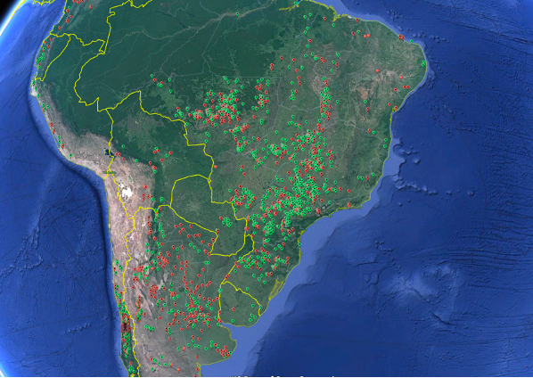

```{r include=FALSE}

#*****************************************************************************************
#******IMPORTING ALL NEEDED LIBRARIES*****************************************************
#*****************************************************************************************

library(ggplot2)
#library(gstat)
#library(sp)
#library(maptools)
library(tidyverse)
library(data.table)
library(geosphere)
library(ggpubr)
library(cowplot)
library(png)
library(jpeg)
library(here)
library(jsonlite)
#library(matlib)
library(Metrics)
#require(graphics)
library(rmutil)
library(pathmapping)

#*****************************************************************************************
#******DEFINE SOME GLOBAL OPTIONS AND SET WORKIND DIRECTORY*******************************
#*****************************************************************************************

#define global options
knitr::opts_chunk$set(echo=FALSE, warning=FALSE, message=FALSE)

#get current path, define file name and import CSV
setwd(here())


```
\
\
\

# INTRODUCTION

\

## Context
Precision Agriculture is on the rise. This requires that timely and precise information from the field are provided to the farmer, so he can take better decisions and apply input materials more precisely. Such information is typically soil or weather data, such as temperature, rain or soil PH. One of the big challenges is that these information from the (large) fields are very sparse. Many precision agriculture Startups have created platforms, which seek to solve this problem by using available data from sample points and ‘distribute’ them to a continuous space, i.e. the entire field. Therefore, the companies use different kinds of Geospatial interpolation techniques (henceforth Interpolation), which map values from data sample points to a continuous geographical. The final result is typically a heatmap, which claims to show the variables for each individual point in the x/y map.
Given that the farmer will base potentially harmful decisions on such maps, there exists a justified concern of how exact and reliable are these information is. This leads to the questions of whether the interpolation techniques applied (which is just a mathematical formula) are doing a good job in estimating the values for the unknown locations. Unfortunately, most of the tools do not provide any in formation regarding uncertainty, which usually is part of a serious statistical estimation process.  
\
\

## Objective & Research Questions
The at hand research intends to shed light onto the above-mentioned question. We will assess the quality of different interpolation algorithms in different settings and for different variables. Our goal is to provide concrete information regarding the quality, its behavior and contextualize this with Meteorological and Statistical techniques.
Initially, we need to clarify and define few important points. Interpolation methods are estimations of unknown values.  Hence, we will use the term estimation and estimator as a surrogate for the interpolation. Further, as every estimation, they are associated with estimation errors. These errors are the main interest of the at-hand study.
We will answer the following questions:

* **Quality of Estimation**: How exact, precise and reliable are different interpolation methods

* **Context Dependency**: Does the exactness, precision and reliability depend on contexts

* **Error behavior**: Can we say anything about the errors behavior?

* **Probabilistic Assessment**: What probabilistic tools can we hire for assessing the uncertainty and errors?

* **Meteorological Assessment**: What meteorological tools can we hire for assessing the errors?

* **Mathematical Assessment**: Can we connect the behavior of errors to modern mathematical tools?  
\
\

## Problem Statement & Set-Up
We are fortunate to have a large meteorological data set at our hand, which is the network of 2600 Agrometeorological Weather Station all over South America. We will use a selection of these data for the study.
\
{#id .class width=300 height=200}
\
\
We select a number of so-called *interpollation regions* in such a way that we have at least 4 weather stations nearby. We purposefully vary the geographical area of such regions so to obtain a good idea of how distance relate to interpolation quality.
Within each region, we choose the stations in a way so that we have always 3 or more stations at the edges of the region, which are the *neighbours*, and one station inside the region, which is denominated the *Point zero*. These neighbours represent our data sample points, from which we try to estimate the data for each point inside the region (this is the interpolaiton process). As we are interested in testing the accuracy of this interpolations, we then test the obtained values against the station at point zero. Important to say that we do not use the values from point zero station for the interpolation - it is only our verification data. 
Below a Schema of the Set-Up:
\
{#id .class width=300 height=200}
\
\
The Mathematical set-up here is:
$$\hat\theta_{0} =f((\theta_{1},d_{1}),(\theta_{2},d_{2}),(\theta_{k},d_{k}))$$ 
Where we look for:
$$f(\theta,d)^{*}=min[{f((\theta_{1},d_{1}),(\theta_{2},d_{2}),(\theta_{k},d_{k}))}-\theta_{0}]$$
\
Where \theta is the parameter to estimate (like temperature, rain) and d is the distance to the respective station. In simple words, what is on scrutiny here is f, the function of the parameter and the distance, which maps our sample data to the unknown estimator.
\
\

## Methodology
We are selecting the regions manually based on the following criteria:
We run then the analytics code in R and 
blablabla

```{r}

#*****************************************************************************************
#****** HERE I DO THE ENTIRE STATISTICS AND PLOTTING USING THE FUNCTIONS *****************
#*****************************************************************************************

#Import the functions
source("Interpolation Study_functions.R")

#this is the only input information
#name of the file where all data set names and paths are stored.
#all this must be in folder 'Data'
filename<-"Interpolation Study_Data Sets.csv"
data_sets<-import_fun(filename)
# 
# #initializing list for result storage
estimators_area<-list()
estimators_meta<-list()
estimators_stats<-list()

#THIS IS INSIDE LOOP FOR EACH DATA SET
for (i in 1:nrow(data_sets)){
  #i=1
  data_set<-data_sets[i,]
  #HERE THE DATA ARE PREPARED
  #importing and transposing the Data frame
  dft<-get_transposed_df(data_set$FileName)

  # #creating Dir and filenames for result saving
  filenames<-file_names(data_set)

  #Extracting the coordinates of Point 0, i.e. the point of interest
  Point_0x<-dft[(row.names(dft) %like% 'erification'),'x']
  Point_0y<-dft[(row.names(dft) %like% 'erification'),'y']
  
  #calculating all distances to from point_0 and write it in df_data
  df_data<-distance_calc(dft, Point_0x, Point_0y)
  
  #getting indices for slicing df_data: (n, k, len_df_data, ind_df_dat)
  index_data<-get_ind_data(df_data)
  
  #getting matrix with all values and vector with all distances
  val_matrix <- df_data[,index_data$ind_df_dat:index_data$len_df_data]
  #filling the distance into a vector from df data
  distvect<-df_data$distanceGeo

  #calculate Area Description (area, av_dist, min_date, max_date)
  area<-get_area(df_data, index_data$len_df_data, index_data$ind_df_dat)
  estimators_area<-c(estimators_area, list(area))
  #creating and saving a plot of the Area
  save_map(df_data,Point_0x,Point_0y, area$av_dist,area$area,filenames$mapname)

  #HERE DESCRIBTIVE STATS ARE CALCULATE
  #creating a new DF for the Stats
  df_stats<-stat_df(dft)
  #getting its slicing indexes
  stats_index<-get_ind_stat(df_stats)

  #creating and saving Describtive Statistics File
  df_stats<-create_stats(df_stats, val_matrix, stats_index, filenames)
  estimators_stats<-c(estimators_stats, list(df_stats))
  
  #creating a new DF for the Score
  df_score<-score_df(dft)
  #getting its slicing indexes
  score_index<-get_ind_score(df_score)

  ## DEFINE SET OF INTERPOLATION METHODS
  ## ->> THIS NEED TO BE ADAPTED IF I WANT TO TEST OTHER FUNCTIONS
  # IDW POWER 1, POWER 2, POWER 3, MEAN
  idw_powers <- c(1,2,3)
  idw_names <- c('IDW_power_1', 'IDW_power_2', 'IDW_power_3')

  #call IDW function
  df_score<-get_idw_estim(df_score, distvect, val_matrix, idw_names, score_index,Point_0x, Point_0y)
  #call mean estimator function
  df_score<-get_mean_estim(df_score, val_matrix, score_index, Point_0x, Point_0y)
  #
  #CALCULATE THE ERRORS OF THE ESTIMATION
  df_score<-get_errors(df_score,score_index,df_stats,stats_index, Point_0x, Point_0y)

  #TESTING DIFFERENT CANDIDATE DISTRIBUTIONS AGAINST EACH OTHER FOR THE BEST FIT
  df_meta<-analyze_errors(df_score,score_index, filenames)
  #listing the meta data frames of each Case
  estimators_meta<-c(estimators_meta, list(df_meta))
}

#I join together the meta results into a nested/nested/nested data frame
result_area <- tibble(Cases = data_sets$SetName,Estimators = estimators_area)
result_stats <- tibble(Cases = data_sets$SetName,Estimators = estimators_stats)
result_meta <- tibble(Cases = data_sets$SetName,Estimators = estimators_meta)
```

```{r}
#*****************************************************************************************
#****** HERE PREPARE THE DATA FOR THE CASE NO 1 *****************
#*****************************************************************************************

#Here I select the case to be displayed
# Goias1 -> i=1
# SerraGaucha1 -> i=2
i=2

# getting the correct area data set
area<-result_area$Estimators[[i]]

#Defining path for the Map
mapname<-paste(getwd(), 'Cases', data_sets$FileName[i], paste('MAP.png',sep = '_'), sep = '/')

# defining the path for importing the correct resulting plots
estim1<-'IDW_power_1'
estim2<-'IDW_power_2'
estim3<-'IDW_power_3'
estimsm<-'Sample_Mean'

estim1path<-paste(getwd(), 'Cases', data_sets$FileName[i], 'Results' ,paste(estim1, 'Combined.png',sep = '_'), sep = '/')
estim2path<-paste(getwd(), 'Cases', data_sets$FileName[i], 'Results' ,paste(estim2, 'Combined.png',sep = '_'), sep = '/')
estim3path<-paste(getwd(), 'Cases', data_sets$FileName[i], 'Results' ,paste(estim3, 'Combined.png',sep = '_'), sep = '/')
estimsmpath<-paste(getwd(), 'Cases', data_sets$FileName[i], 'Results' ,paste(estimsm, 'Combined.png',sep = '_'), sep = '/')

#getting and preparing the statistics data set
df_stats<-result_stats$Estimators[[i]]
df_stats<-df_stats %>% select(1,4)
df_stats<-modify_if(df_stats, ~is.numeric(.), ~round(., 2))


#dfm<-result_meta$Estimators[[i]]$Results[[1]] #1 - 3 depending on estimator

```
\
\

# CASE-BY-CASE WALK THROUGHS
\

## Case 1: Air Temperatures in Goias, Brazil
\

### Area & Setting

First, we set the stage:

<div style= "float:right;position: relative; top: -25px;">
```{r echo=FALSE, out.width="360px", fig.align='right'}
# plotting the map
knitr::include_graphics(mapname) 
```
</div>

* Variable:               Air Temperature

* Number of Neighbors:    `r area$k` Metos Weather Station (IMT300 and EcoD3)

* Av. Distance:           `r area$av_dist`m

* Interpolation Area:     `r area$area`HA

* Starting Date:          `r area$min_date`

* End Date:               `r area$max_date`

* No of observations:     `r area$n` (hourly data)
\
\
### Descriptive Statistics

Let's go ahead with the analytics. We want to get some descriptive statistics from the data so to understand what we have in hand:
\
```{r, echo=FALSE}
knitr::kable(df_stats, format="markdown", row.names = FALSE)
```
\
\
We can observe that within our area of interest of  `r area$area`HA, we have an average temperature over the period measured of  `r df_stats[6,2]`ºC. However, this temperature is not a good representation for the entire field. We see an average standard deviation of `r df_stats[5,2]`ºC. This means, at any given moment, we have to expect that the 'average spot' within this field deviates `r df_stats[5,2]`ºC from the mean of the field temperature. The difference between the hottest and the coldest measurement is even bigger (of course!). In average over the period, the difference between the maximum and the minimum temperature is `r df_stats[2,2]`ºC.
This is remarkable! Such differences are important for agronomic decisions. I
because it justifies that we work with multiplie weather staitons in that area and it also gives weight to our at hand study. 
\
\

### Interpolation Estimators

Let's keep on then. We are now ready to run the following interpolation methods for estimating the temperatures at Point 0.

•	Inverse Distance weighing with power 1

•	Inverse Distance weighing with power 2

•	Inverse Distance weighing with power 3

•	Sample mean, i.e. we just use the average temperature of all 4 stations as an estimator

Remember that we do this for each of the `r area$n` hourly temperatures and without using the weather station from Point 0. Once we have this estimation, we then  calculate the error for each hour by *subtracting the estimated values from the Verification Station* at Point 0.
This error is is what interests us most, because it tells us how much we can trust into a given interpolaiton method.Here the results:

\
\
<div style= "float:left;position: relative; top: 20px;">
```{r echo=FALSE, out.width="750", fig.align='right'}
#insert plot of result IWD 1
knitr::include_graphics(estim1path) 
```
</div>
\
\
<div style= "float:left;position: relative; top: 20px;">
```{r echo=FALSE, out.width="750", fig.align='right'}
#insert plot of result IWD 2
knitr::include_graphics(estim2path) 
```
</div>
\
\
<div style= "float:left;position: relative; top: 20px;">
```{r echo=FALSE, out.width="750", fig.align='right'}
#insert plot of result IWD 3
knitr::include_graphics(estim3path) 
```
</div>
\
\
<div style= "float:left;position: relative; top: 20px;">
```{r echo=FALSE, out.width="750", fig.align='right'}
#insert plot of result sample mean
knitr::include_graphics(estimsmpath) 
```
</div>
\


